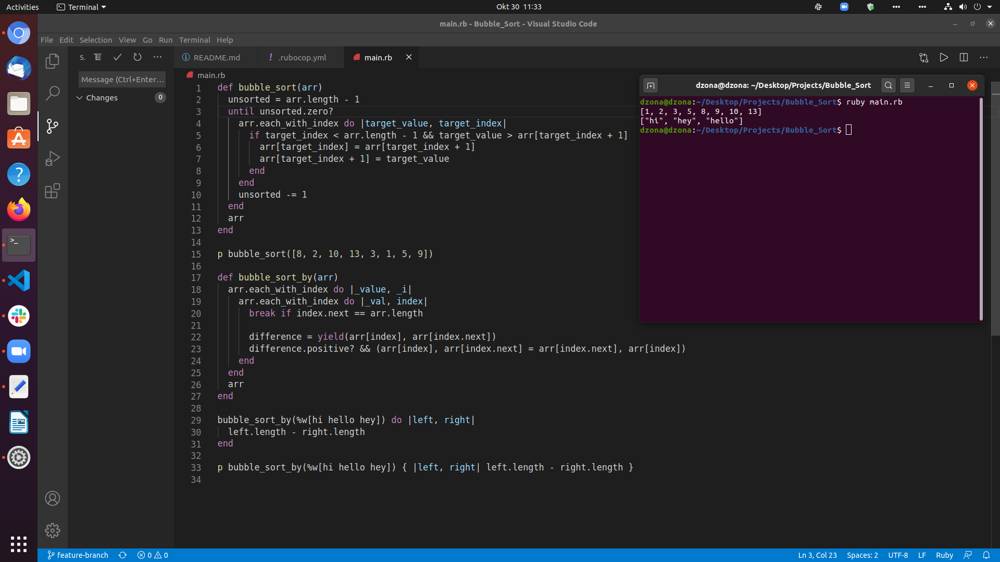

# The Bubble Sorting Algorithm

> This is simple sorting algorith that sorts array. Main idea is to "bubble" biggest number at end of array in each itteration.

This project is the first one in the Ruby module at Microverse. Main goal was to build develop sorting algorithm.

We worked on all the requirements given on this project.

## Built With

- Ruby

##Getting Started

Just clone this repo and and navigate to the folder.

To get a local copy up and running follow these simple example steps.

Clone this repo.
Navigate to the bubble_sort folder
In your terminal run ruby main.rb
You are successful to get a local copy up and running.

## Live Demo

[Live Demo Link](https://raw.githack.com/zdrale/Responsive-Web-Page/master/index.html)

## Authors

👤 **Mohammed Naqhid**

- GitHub: [@Mohammed Naqhid ](https://github.com/Naqhid)
- Twitter: [@naqhid](https://twitter.com/naqhid)
- LinkedIn: [@Naqhid](https://www.linkedin.com/in/mohammed-naqhid-ab3080189/)

👤 **Nikola Zdrale**

- GitHub: [@zdrale](https://github.com/zdrale)
- Twitter: [@zdralenikola](https://twitter.com/zdralenikola)
- LinkedIn: [@nikola-zdrale](https://www.linkedin.com/in/nikola-zdrale/)

## 🤝 Contributing

Contributions, issues, and feature requests are welcome!
